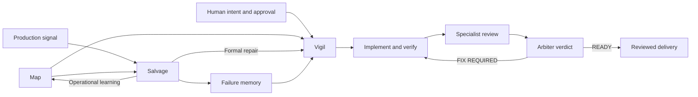

# Cressetide architecture

Cressetide is the repository for the nested `ctide` plugin. The plugin is
listed in the separate `kktu6507/plugins` marketplace repository, not here.
The architecture keeps public commands, orchestration roles, advisory hooks,
and repository-local evidence separate so each contract can be validated
independently.

## Repository boundary

```text
.
├── cressetide/
│   ├── .claude-plugin/plugin.json
│   ├── agents/
│   ├── hooks/
│   └── skills/
├── docs/
├── eval/
├── examples/
└── test/
```

The `kktu6507/plugins` marketplace exposes `ctide@kktu` from this
repository's `cressetide/` directory. The plugin manifest owns the eleven
agent registrations. Skill discovery supplies the five public commands. Hook
discovery is declared inside the plugin root and must resolve every script
through `${CLAUDE_PLUGIN_ROOT}`.

## Capability loops



### Vigil

Vigil is the plan-approved engineering loop. It restates intent, grounds the
plan in current evidence, obtains human approval, delegates the smallest safe
implementation, verifies observable criteria, selects a risk-proportional
panel, and asks `arbiter` for `READY`, `FIX REQUIRED`, or `NOT READY`.

### Salvage

Salvage is the production incident loop. It preserves sanitized evidence
before state-changing action, presents one decision card per production
action, applies reversible mitigation, verifies the effect, diagnoses the
fault domain, and sends formal repairs to Vigil. Re-entry requires explicit
criteria, health signals, an observation window, and rollback readiness.

### Map

Map builds, refreshes, or verifies `.ctide/map/SYSTEM_MAP.md`. It records
current source paths, commit identity, confidence, and uncertainty. Map output
accelerates discovery; consumers must verify the affected area directly.

### Doctor

Doctor performs read-only local probes for manifest identity, Node 20 or newer,
hook wiring, harmless fail-open behavior, debug output, skill inventory, and
agent inventory. It does not change configuration or perform telemetry and
network probes.

### Ship

Ship reads the run ledger, project manifests, `CHANGELOG.md` history, git
tags, and the Map's Rollback section since the last release tag, and reports
a read-only release-readiness decision card: version consistency, changelog
touch, tag readiness, migration compatibility, and a conditional checksum
check. It never executes a build, test, or deploy step, never picks or bumps
a version, and never writes anything.

## Roles

| Role | Responsibility |
| --- | --- |
| `navigator` | Read-only repository grounding and plan evidence. |
| `implementer` | The smallest safe implementation after approval. |
| `intent-reviewer` | Requirement and acceptance-criteria fidelity. |
| `test-reviewer` | Verification depth, failure paths, and regression risk. |
| `code-reviewer` | Local quality, framework use, resources, and efficiency. |
| `security-reviewer` | Trust boundaries, unsafe inputs, secrets, and exposure. |
| `architecture-reviewer` | Boundaries, dependency direction, and placement. |
| `operability-reviewer` | Runtime resilience, observability, and rollback. |
| `ui-ux-reviewer` | User-facing states, clarity, accessibility, and layout. |
| `arbiter` | Evidence aggregation and final readiness verdict. |
| `cartographer` | Read-only Map discovery and provenance collection. |

Reviewers hold no editor tools: `Read`, `Grep`, `Glob` and `Bash` for inspection
only. Review-only behavior is enforced by **policy and context isolation, not by
a hard read-only capability boundary** — `Bash` can in principle write, so the
constraint is contractual and is why reviewers propose fixes rather than apply
them. The coordinating thread owns writes, conflict resolution, and serialized
failure-memory updates.

## Hook boundary

Six hooks add fail-open guidance and contract checks:

- `plan-gate.js`
- `destructive-guard.js`
- `contract-guard.js`
- `load-failure-memory.js`
- `compact-fidelity.js`
- `orchestration-check.js`

They accept bounded event input, avoid exposing secrets, and return control if
input is missing, malformed, too large, or unsupported. They are defense in
depth for the workflow, not a sandbox, authorization system, or operating-system
security boundary. An agent must not weaken a hook to bypass a denial.

## State and evidence

`.ctide/` is the sole project state root. It separates the system Map, failure
memory, design context, incident journals, decision records, run ledger, and
task output, in three classes:

- **Committed semantic state** — `memory/`, `design/`, `map/`, `incidents/`,
  `decisions/`, `provenance.json` — versioned with the project.
- **Persistent episodic state** — `ledger/` — self-gitignored, never overwritten
  or truncated, and survives across runs.
- **Per-run scratch** — `output/` — self-gitignored and overwritten each run.

Separately, `test-provenance-loop/` is a **durable, untracked, tool-owned
prefix** reserved for the review-loop controller. The controller writes no nested
`.gitignore` there, so a consuming project should ignore that prefix explicitly
and only that prefix — ignoring `.ctide/` wholesale would drop committed semantic
state. The head view's exclusion of the prefix is a separate rule evaluated
before trackedness, so it holds whether or not the path is gitignored.

Path-level specifics, including the exclusion rule and its stated cost, are in
`docs/runtime-contract.md`.

## Test provenance

A task carrying the provenance workflow — one with a current TaskState in the
validated store — runs a **TP-active** variant of the review step. It binds test
evidence to its source so a stale claim is refused rather than believed, and it
changes three things a user can observe:

- the real `test-reviewer` always runs and is never evidence-substituted, **even
  when the changed-test inventory is legitimately empty**;
- the `arbiter` reports `loop` and `provenance` gate halves plus their
  `combined` result, and either half false blocks `READY`;
- the run keeps canonical state: a `provenance.json` store and the durable
  `.ctide/test-provenance-loop/` prefix above.

A task that does not use the provenance workflow is unaffected: the step is
skipped entirely and the ordinary lifecycle applies. That is a property of tasks
**outside** the workflow. A task inside it whose TaskState is missing or fails
validation is not thereby excused from these checks — an unestablished inventory
is a failed required check, never an empty one, and it is fixed before the panel
is selected rather than routed around.

The controller's operations and the store's schema are internal; the
observable contract is in `docs/runtime-contract.md` and
`cressetide/skills/vigil/SKILL.md` step 4b.

Evidence moves through bounded Review Packets rather than full conversation
transcripts. A packet states intent, numbered criteria, in/out of scope,
assumptions, changed files, verification, risks, context exclusions, and the
reviewer's focus. Final reports retain literal verdict, severity, and sentinel
tokens for deterministic checks.

## Trust model

- Human approval authorizes implementation and production-affecting decisions.
- Repository files, commands, tests, runtime observations, and reviewer reports
  are evidence classes; generated prose alone is not proof.
- Map claims are advisory and may be stale or incomplete.
- External capabilities are optional until detected and observed.
- A failed or unrun required check prevents `READY`.
- `ctide:delivery=shipped` describes delivery of reviewed work, not a Git push
  or published release.

See [`SECURITY.md`](SECURITY.md) for security boundaries and
[`docs/runtime-contract.md`](docs/runtime-contract.md) for exact settings,
environment variables, debug prefixes, and machine sentinels.
