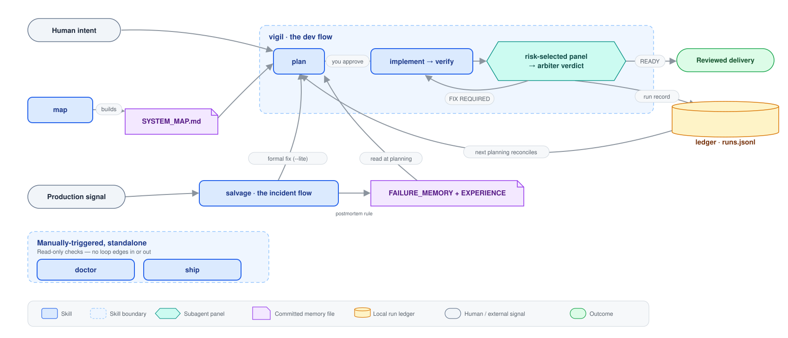

<p align="center">
  <picture>
    <source media="(prefers-color-scheme: dark)" srcset=".github/assets/logo_mono.png">
    
  </picture>
</p>

# ctide — Cressetide（Claude Code 外掛）

[](https://github.com/kktu6507/cressetide/actions/workflows/validate.yml)

[English](README.md) · **繁體中文** · [日本語](README.ja.md)

**ctide 讓 Claude Code 像謹慎的 release engineer 一樣工作：** 先規劃、經你核准後才改 code、用證據驗證，最後給出 `READY` / `FIX REQUIRED` / `NOT READY`。

ctide 用兩條 flow 覆蓋從開發到正式環境。**dev flow** 是以 plan 為閘門的程式碼審查與 release-readiness workflow：plan → 核准 → 實作 → 驗證 → 依風險挑選 reviewer → verdict。**incident flow** 則是把這條 flow 反過來，用在正式環境的緊急事故：先止血（mitigate first）、再診斷，正式修復交回 dev flow，最後以 postmortem 收尾。

ctide 不是 bug scanner、linter、static analysis、CI 替代品，也不是零 bug 保證。

它的工作是讓 AI-made change 可追溯：明確意圖、acceptance criteria、最小安全實作、真實驗證證據、依風險挑選 reviewer，以及 arbiter verdict。

```text
Dev flow       任務 -> 理解需求 -> Plan（尚未改動程式）-> 你核准 plan + acceptance criteria
                    -> 最小安全變更 -> build / test / lint / browser evidence
                    -> 依風險挑選 reviewer -> Gatekeeper verdict
                           READY / FIX REQUIRED / NOT READY -> 必要時進入 repair loop

Incident flow  警報 -> Triage -> 保全證據 -> 先止血（可回復的動作，一次一張 decision card）
                    -> 診斷 -> red repro -> 經上方 dev flow 修復（--lite）
                    -> 重回正式環境 + 觀察期 -> postmortem

學習迴圈       run verdict -> ledger 記錄 -> 下一次 planning 對帳：escaped / survived？
               incident postmortem -> FAILURE_MEMORY -> 下一次 dev flow 的 planning 會讀它
```

## 裡面有什麼

<p align="center">
  
</p>

- **兩條 flow**：dev（[`vigil`](#開發流程vigil)）與 incident（[`salvage`](#事故應變流程salvage)）。事故的正式修復會以 `--lite` run 交回 dev flow，並以「事故的 reproduction 轉綠」作為主要 acceptance criterion。
- **五個 skill**：`vigil` 與 `salvage` 會自行啟用（不是小修小補就會自動接手／聽到像事故的描述就會出動）；[`map`](#ops-地圖map)、[`doctor`](#健康檢查doctor) 與 [`ship`](#release-readiness-檢查ship) 手動啟動（`/ctide:map`、`/ctide:doctor`、`/ctide:ship`）。
- **[11 個 subagent](#開發流程vigil)**：一位 navigator、一位 implementer、七位依風險挑選的 reviewer、一位 cartographer，以及判定就緒的 arbiter。
- **[6 個 hook](#hooks-與安全模型)**：local-only、零依賴的 Node guardrails，包含 plan gate、破壞性指令 guard、contract guard、failure-memory 注入、compaction 提醒、delivery-claim 檢查。
- **[學習迴圈](#學習迴圈)**：每次 run 以一筆 ledger 記錄收尾；下一次 run 開頭先檢查過去的 verdict 是否站得住。

### 專案佈局

ctide 放進你專案裡的所有東西，都收在一個根目錄底下：

```text
.ctide/
  memory/     # FAILURE_MEMORY.md + EXPERIENCE.md — 下一次 plan 會讀的教訓與已驗證模式（committed）
  design/     # design.md — UI design contract（committed）
  map/        # SYSTEM_MAP.md — 儲存庫與操作就緒 Map（committed）
  incidents/  # INCIDENT-<date>-<slug>.md journals — 稽核軌跡（committed）
  decisions/  # DECISION-<date>-<slug>.md — 選擇 X 而非 Y 的理由與重新檢視條件（committed）
  ledger/     # runs.jsonl — append-only 執行歷史（跨執行留存、自帶 gitignore）
  output/     # 每次執行的 scratch：contract.md、evidence、review diffs（永不 commit、自帶 gitignore）
```

舊版佈局（`ai/FAILURE_MEMORY.md`、repo 根目錄的 `design.md`、`.ctide/legacy-output/`）只會遷移一次，由 workflow 自己搬，搬了什麼當次就會講清楚。

## 30 秒理解

ctide 做三件事：

| 時機 | ctide 補上的紀律 |
|---|---|
| **寫程式前** | Claude 重述需求，整理 plan 與 acceptance criteria，並等待你核准。 |
| **寫程式時** | `implementer` 只做最小安全變更，且不能自我認證。 |
| **交付前** | 依風險挑選 reviewer 對著你的意圖審查，最後由 `arbiter` 判定 `READY` / `FIX REQUIRED` / `NOT READY`。 |

正式環境出事故時，`salvage` 在火線上補上同樣的紀律：

| 時機 | ctide 補上的紀律 |
|---|---|
| **最初幾分鐘** | 先做證據快照（約 1 分鐘、不可跳過），再做可回復的止血動作，一次一張 decision card；你永遠不必讀 code。 |
| **穩定之後** | 依 fault domain 診斷，任何修復前先過 red→green reproduction 閘門。 |
| **正式修復** | 交給上方的 dev flow；incident skill 絕不對正式環境 hot-patch。 |
| **收尾之後** | postmortem 餵進 failure memory，下一次 dev flow 的 plan 就已經知道了。 |

**使用 ctide** 當「done」必須等於「可發佈」：合併到 `main`、要出使用者看得到的改動，或動到 auth、data、API/schema contracts、migrations、production behavior、高風險 UI flow。

**跳過 ctide**：typo、純格式化這類零風險小改就別動用它，linter、formatter 這種便宜又穩定的工具先上。

ctide **不是** CI 替代品、linter 或 static analysis、零 bug 保證，也不會幫你逐行掃過所有檔案。tests、linters、static analysis、dependency scanners 照用，高風險 release 也照樣找人 review。機械問題交給它們，ctide 管的是：這個 AI 做的變更，到底有沒有做到你要的、能不能出貨。

> 實機示範：[ctide-public-demo](https://github.com/kktu6507/ctide-public-demo) 記錄了一次完整 `/ctide:vigil`。

## 快速開始

前置需求：**Claude Code** + `PATH` 上有 `node`。hook 是 Node 腳本；沒有 Node 的話 hooks 就直接不動作，也不會報錯。

```text
# 在你的專案目錄、Claude Code 內：
/plugin marketplace add kktu6507/plugins
/plugin install ctide@kktu
# ctide 裝完預設是停用的 - 請在 /plugin 裡把它切為啟用
#   或：claude plugin enable ctide@kktu
/reload-plugins

# 交給它一個任務：
/ctide:vigil 修好登入流程，讓 expired access token 在重試失敗 request 前只 refresh 一次。

# 在需要之前先準備：建立事故用的 ops 地圖（log 在哪、rollback 路徑、kill switches）
/ctide:map

# 事故發生時，講白話就夠了——skill 會在事故語言上自動啟用：
正式環境掛了，上次 deploy 之後 checkout 一直回 500
```

> 第一次用 ctide？先走一遍[你的第一次執行，從頭到尾](docs/tutorial-first-run.md)。

- **安裝不等於啟用。** 啟用前，ctide 的 hooks 與 skills 都不做事。
- **Marketplace 名稱是 `kktu`。** 安裝 id 是 `ctide@kktu`。
- **更新：** `/plugin marketplace update kktu`（更新 marketplace 目錄）→ `/plugin update ctide@kktu` → `/reload-plugins`。
- **健康檢查：** gate 沒擋、hook 沒反應、或 Node 可能不存在時，跑 [`/ctide:doctor`](#健康檢查doctor)。

## 開發流程（vigil）

一次 run 會走過這些階段：

| 階段 | 發生什麼 |
|---|---|
| **Understand** | 重述需求；只有當歧義會改變 behavior、contracts、destructive operations、security 或 UX 時才問。 |
| **Plan** | 保持唯讀，把做法對到 repo 的實際狀況，整理 acceptance criteria。 |
| **Approval** | 你核准 plan 與 criteria 前不改 code。 |
| **Implement** | `implementer` 套用最小安全變更，並寫出本次執行的 task contract（`.ctide/output/contract.md`）。 |
| **Verify** | 依需要跑 build / test / lint / typecheck / browser evidence；command exit status 是權威。 |
| **Review** | 只跑與風險相關的 reviewer，且使用聚焦的 Review Packet，不靠整段 thread history。 |
| **Gatekeeper** | 彙整 findings、依 impact 重評、逐條檢查 acceptance criteria，判定 `READY` / `FIX REQUIRED` / `NOT READY`。 |

Verdicts 是 release-readiness decisions，不是絕對真理。請看 [`docs/how-to-read-verdicts.md`](docs/how-to-read-verdicts.md)（英文）。

**審查面板。** reviewer 不用你挑，ctide 依**風險**組面板：打錯字誰都不會出動，動到登入驗證就會把 security reviewer 加進來。完整名單：

| Agent | 角色 | 何時加入 | 模型 |
|---|---|---|---|
| `navigator` | 拿實際程式碼驗證計畫站不站得住、草擬方法與面板、偵測 `design.md`（唯讀；輔助計畫核准，絕不取代） | 高風險／正確性關鍵的規劃 | inherit |
| `implementer` | 最小安全變更；絕不自我認證 | 計劃核准後 | inherit |
| `intent-reviewer` | 需求／業務規則／契約符合度 | 核心（非瑣碎） | inherit |
| `test-reviewer` | 缺測試、薄弱驗證、邊界、回歸 | 核心；低／中風險可證據替代 | inherit |
| `code-reviewer` | 本地品質、可維護、框架用法、效率 | 非瑣碎程式變更 | inherit |
| `security-reviewer` | auth/authz、輸入處理、secret、信任邊界 | 安全相關風險 | **opus** |
| `architecture-reviewer` | 分層、邊界、相依方向、放置 | 結構性疑慮 | inherit |
| `operability-reviewer` | 可觀測性、retry/timeout、部署、rollback | runtime／正式環境影響 | inherit |
| `ui-ux-reviewer` | 易用性、互動、狀態、無障礙；存在時對 `design.md` 一致性 | UI 影響 | inherit |
| `cartographer` | 建立、更新、驗證 repo-grounded Map | 建立／更新／驗證 Map 時 | inherit |
| `arbiter` | 彙整、依衝擊重評、判定就緒 | reviewer 跑完後 | **opus** |

- **reviewer 不持有 editor 工具**：僅 `Read` / `Grep` / `Glob` / `Bash` 供檢查；唯審查、不編輯是靠政策與情境隔離強制，而非硬性的唯讀能力邊界（詳見 [`ARCHITECTURE.md`](ARCHITECTURE.md)）。由它們提出修法，再由 `implementer` 執行。
- **正確性關鍵路徑配置至少兩個獨立視角**：parsing、數值／編碼／溢位、並行、安全、資料完整性，避免大家帶著同一種盲點一起漏看。

**把任務寫好。** ctide 對著你陳述的意圖審查，所以最好的任務會交代需求、acceptance criteria、不可變更範圍、預期驗證與風險區域。模板與 bad / better / best 範例：[`docs/task-writing-guide.md`](docs/task-writing-guide.md)（英文）。

**單次執行旗標。** `--lite`（最小面板）、`--deep`（對抗式驗證）、`--report full`（詳細報告）；細節見「設定參考」一節。

## 事故應變流程（salvage）

正式環境壞了，坐在鍵盤前的人卻沒寫過這些 code——AI 寫的系統，這就是常態。`salvage` 是把 dev flow 反過來：**先止血、再診斷、正式修復放最後。**

它會在事故語言（「production is down」「使用者全被擋住了」）上自動啟用，也可用 `/ctide:salvage` 手動啟動。所有人機互動都是 decision card；處理事故永遠不需要你讀 code。

| 階段 | 發生什麼 |
|---|---|
| **1 · Triage** | 用證據驅動，不是問卷訪談：跑 health/error 檢查，確立嚴重度（SEV1–3）、影響範圍、資料是否正在持續損壞，以及一個明確的「這會不會是入侵？」檢查。 |
| **2 · 保全證據** | 約 1 分鐘的快照（logs、時間戳、執行中的版本），在任何東西被重啟*之前*。不可跳過，再急也一樣。 |
| **3 · Mitigate（迴圈）** | 可回復、不寫新 code 的動作：rollback（先過 migration 相容性 pre-check）、關 feature flag、degrade、擴容、維護模式。一次一個，每個都先驗證。「把未經審查的 code 直接 hot-patch 上正式環境」會被直接點名是經典的二次災難，並拒絕執行。 |
| **4 · 診斷** | 先做 fault-domain 分類：code、config／環境、基礎設施、外部相依、或 data。只有 code 與 data 會走到 reproduction；其餘直接補救，外加一個先宣告好的 fixed-check。 |
| **5 · Reproduce** | 任何修復前先有 red reproduction，失敗輸出記錄進 journal。從沒紅過的檢查證明不了任何事。 |
| **6 · Fix** | 交給 dev flow：一次 `vigil --lite` run，以「事故 repro 轉綠」為主要 acceptance criterion。 |
| **— 資料修復** *（發生損壞時）* | code fix 只能止住新的損壞，修不了已造成的傷害。損壞時間窗 → 受影響筆數 → 修復 script 先在抽出的 COPY 上證明 red→green → 經人核准才碰正式環境。 |
| **— 重回正式環境** | 走平常的 deploy 路徑部署、驗證先前宣告的 fixed-check、守完觀察期，再一次一個地恢復先前的止血措施。 |
| **7 · 收尾 + postmortem** | 收尾 checklist（止血措施全數恢復、資料修復完成、抽出的資料已刪除、journal 關閉），加上一份簡短、不咎責的 postmortem，內含餵入[學習迴圈](#學習迴圈)的 gate-gap 分析。 |

- **Decision cards**：一次一張，內容是建議、成本／取捨、可回復性，以及核准後會執行的確切內容。破壞性或影響正式環境的動作永遠停在一張 card 上，絕不打包進先前核准過的 plan；`destructive-guard.js` hook 可能額外詢問，那是預期行為，絕不繞過。
- **事故 journal**：每個階段都 append 到 `.ctide/incidents/INCIDENT-<date>-<slug>.md`，committed 的稽核軌跡（時間線、每個動作與核准者、證據、red→green 記錄）。先消毒再寫入：任何東西進 journal 前，PII 與 secrets 都先遮罩。
- **正式資料安全閘門**：reproduction 需要真實資料時，只做最小抽取（只取證據指涉的紀錄，絕不 dump 整庫）、資料進入 AI context *之前*先遮罩、政策禁用正式資料時改用 synthetic data；抽出的資料是暫時性的，永不 commit、收尾時刪除。

它不做的事，一句講完：不做 paging/on-call、不做 status-page 自動化、不做 SLO 套件、不做完整 RBAC、不做 DFIR 級鑑識（它做分類、圍堵，並建議找專業人員）、不做多 repo 事故指揮。完整的階段契約在 [`cressetide/skills/salvage/references/`](cressetide/skills/salvage/references/)：`wartime.md`、`reproduction-and-repair.md`、`reentry-and-closure.md`。

## Ops 地圖（map）

**在需要之前先準備。** `/ctide:map` 會建立 `.ctide/map/SYSTEM_MAP.md`：這張平時地圖讓戰時從 30 秒開始，而不是 30 分鐘。裡面有標明 agent-runnable 與 human-only 的存取清單、附 schema-migration 相容性情報的 rollback 步驟、feature flags、備份與可觀測性。

每個條目都帶信任標記（`verified: <date>`、`dry-run-verified: <date>` 或 `UNVERIFIED`）；未驗證的 rollback 指令會在依賴它的 decision card 上被標出，絕不默默信任。

Map 會誠實回報操作就緒缺口（「找不到備份，今天不可能做 restore」）。

Map 承接 operational-preparation 契約：[`operational-readiness.md`](cressetide/skills/map/references/operational-readiness.md)（英文）。

## 健康檢查（doctor）

`/ctide:doctor` 做本機、唯讀的 hooks 與環境自檢（plugin 身分、Node 是否存在、hook 有沒有接上），且不傳送任何東西（無 telemetry）。gate 沒擋、hook 沒反應、或 Node 可能不存在時就跑它。

加上 `--project`（可搭配 `--cwd <path>`）會多疊兩項檢查：`failure-memory-health` 摘要專案自己的 `FAILURE_MEMORY.md`（不會碰機器全域那份），`incident-journals` 標出 `.ctide/incidents/*.md` 裡還沒確認 `closed` 的項目。兩者都是選配、疊加式的——預設的 `/ctide:doctor` 輸出不會變。

## Release-readiness 檢查（ship）

`/ctide:ship` 是手動、唯讀的：它從不執行你的 build、test 或 deploy pipeline，也從不寫入任何東西（不打 git tag、不改版號、不寫 changelog 條目）。它讀取既有的東西——上次 release tag 以來 ledger 裡每筆 `READY` 的 run、`package.json`、`CHANGELOG.md` 的 git 歷史、git tags，以及 `SYSTEM_MAP.md` 的 Rollback 章節——輸出一張 decision card：待處理批次，接著四項檢查（版號一致性、`CHANGELOG.md` 是否改過、tag 是否就緒，以及 Map 帶來的 migration compatibility），每項都是 `pass` / `fail` / `not-applicable` / `unverified`，並附引用證據。

第五項檢查——checksum 驗證——只在你明確帶入 `--artifact` 與 `--checksum` 時才跑；ship 從不猜你 repo 裡哪個檔案是 build artifact。版號一致性只讀 `package.json`。

Ship 是你真正發布前讀的 pre-flight checklist——不是你 release pipeline 的替代品。

## 學習迴圈

run 與 run 之間，ctide 會把學到的東西接起來——輸的、贏的都記：

- **每次 run 以一筆 ledger 記錄收尾。** verdict 鎖定後，一行 event-fact 會 append 到 `.ctide/ledger/runs.jsonl`：任務、改動的檔案（由 `git diff` 計算，絕不採信 agent 的口述）、verdict、驗證狀態、面板、修復輪數、findings，以及計畫 scope 與實際觀察到的 drift。只記事實：ledger 永不儲存分數、比率或百分比。
- **下一次 run 開頭先檢查過去的 verdict 是否站得住。** planning 會掃描後續 commits 是否重工了過往 run 記錄的檔案，並把該筆 run 處置為 `escaped` / `survived` / `superseded` / `building-upon`。判斷不了的重疊會標成「needs human review」交給人看，不會默默當沒事。14 天內出現三筆 `escaped` closure，結尾報告會建議一次 retro（[`docs/advanced/retro-practice.md`](docs/advanced/retro-practice.md)（英文））。這些統計只是講給你聽的，而且要等 verdict 定案才出現，絕不回頭調整本次 run 的 scope、面板或 verdict。
- **教訓由兩份進 git 的記憶檔負責記住。** `.ctide/memory/FAILURE_MEMORY.md` 存 prevention rules（來自事故 postmortem 與 escaped 缺陷）；SessionStart hook 會注入 untrusted digest，讓下一次 plan 讀到。`.ctide/memory/EXPERIENCE.md` 存已驗證的正向模式（`candidate → validated → standard`；`standard` 必須掛上連結的可執行資產，只有文字描述永遠升不上去）。

完整契約：[`run-ledger.md`](cressetide/skills/vigil/references/run-ledger.md)（英文）· [`experience-memory.md`](cressetide/skills/vigil/references/experience-memory.md)（英文）。

## Hooks 與安全模型

只要 plugin 被啟用，六個零依賴 Node hooks 會在每個 session 執行。它們 local-only、fail-open，只使用 Node built-ins（`fs`、`os`、`path`、`crypto`）。

| Hook 腳本 | 觸發事件 | 用途 |
|---|---|---|
| `plan-gate.js` | `PreToolUse` | 在 plan mode 中擋下 edit tools 與明顯 Bash/PowerShell writes。 |
| `destructive-guard.js` | `PreToolUse` | 對 `rm -rf`、`git reset --hard`、`git push --force`、PowerShell `Remove-Item -Recurse`、`terraform destroy`、`kubectl delete namespace`、`docker volume rm/prune`、資料庫 drop 類 CLI（`dropdb`、`mysqladmin`、`redis-cli flushall`）等狹義不可復原 destructive commands 先詢問。 |
| `contract-guard.js` | `PreToolUse` | 守著合約不被中途弱化：編輯若會刪掉或改寫驗收條件、移除 `mustNotChange`／範圍清單項目、調降風險（合約在 `.ctide/output/contract.md`，含舊版 `.ctide/legacy-output/`），或整段刪除 `design.md` 章節，先問過你才放行；對 `.claude/settings*.json` 的編輯若會把任何 ctide guard 開關從開翻成關（連新建一個 settings 檔來翻也算），同樣先問。 |
| `load-failure-memory.js` | `SessionStart` | 讀取專案 `.ctide/memory/FAILURE_MEMORY.md`（舊版 `ai/FAILURE_MEMORY.md` 作為唯讀 fallback），否則讀全域 `~/.claude/FAILURE_MEMORY.md`，並注入 nonce-fenced、untrusted digest。 |
| `compact-fidelity.js` | `SessionStart` · `compact` | context compaction 後重新注入精簡 workflow-continuity reminder。 |
| `orchestration-check.js` | `Stop` | delivery claim 與 missing panel、blocking verdict、failed/unrun verification、missing live-run evidence 矛盾時提示。 |

這些 hooks 不會刪檔、不會改系統設定、不會改權限、不會開 subprocess、不會下載 code，也不會傳送 code/transcript。它們是 guardrails，不是 sandbox；詳見 [`SECURITY.md`](SECURITY.md) 與 [`ARCHITECTURE.md`](ARCHITECTURE.md)。

hooks 也絕不遷移、寫入或刪除 ctide 的專案檔案；舊佈局的一次性遷移是由 workflow 本身執行，在你的 session 裡以看得見的 tool 動作完成。每個會詢問或限制的 hook，都可以針對單一專案 opt out，見「設定參考」一節。

## 設定參考

以下皆為選填，ctide 的預設行為不需要任何設定。

**常駐設定**：`.claude/settings.json` 或 `.claude/settings.local.json`（local 優先），都放在 `"ctide": { ... }` 底下。每一項**預設開啟**；設成 `false` 可針對該專案 opt out：

| Key | 停用的東西 |
|---|---|
| `planGate` | `plan-gate.js`：plan mode 期間強制的編輯攔阻 |
| `destructiveGuard` | `destructive-guard.js`：執行狹義不可復原 destructive commands 前的詢問 |
| `contractGuard` | `contract-guard.js`：contract／design 弱化前的詢問，含把這些 guard flag 關閉前的詢問 |
| `preserveOnCompact` | `compact-fidelity.js`：context compaction 後的 workflow-continuity 提醒 |

設定檔格式錯誤或讀不到，會視為「未停用」（fail-safe：guard 照常運作）。範例——針對單一專案停用 `contract-guard.js`：

```json
// .claude/settings.json
{
  "ctide": { "contractGuard": false }
}
```

**環境變數**（預設未設定）：

| 變數 | 設定後的效果 |
|---|---|
| `CTIDE_ENFORCE_STOP` | 設成任何非空值，會讓 `orchestration-check.js` 這個 Stop hook 在 verdict/evidence 矛盾時直接硬擋 delivery，而不只是提示 |
| `CTIDE_HOOK_DEBUG` | 設成 `1` 會讓每個 hook 都多印一行 debug trace（[`/ctide:doctor`](#健康檢查doctor) 與手動排除故障會用到） |

```bash
CTIDE_ENFORCE_STOP=1 claude            # bash/zsh
```

```powershell
$env:CTIDE_ENFORCE_STOP = "1"; claude  # PowerShell
```

**跟著單一任務啟用的能力**：預設關閉，只在該次任務明確啟用時才開，永遠不是硬性依賴：

| 能力 | 如何啟用 |
|---|---|
| Codex 跨模型第二意見 | 在任務裡明講（例如「修復迴圈卡住時可以用 Codex」）；見 [`references/external-capabilities.md`](cressetide/skills/vigil/references/external-capabilities.md) |
| 每位審查員的 MCP 工具 | 預設 `.mcp.json` 是空的；加一個 server（見 [`mcp.example.json`](cressetide/mcp.example.json)），並取消該審查員 frontmatter 裡對應 `mcp__*` 那行的註解 |

**單次執行旗標**（當作參數傳給 `/ctide:vigil`）：

| 旗標 | 效果 |
|---|---|
| `--deep`（或 `deep:` / `ultra:` 前綴） | 啟用 deep-mode Tier 2：對發現的問題做對抗式驗證，`arbiter`/`security-reviewer` 拉到最高推理強度；會提高成本，永遠不會自動啟用 |
| `--no-deep` / `--shallow` | 關閉 deep-mode Tier 1 的確定性小組執行機制（原本在高風險／correctness-critical 工作上會自動啟用） |
| `--lite` | 強制用最小夠用的審查小組，跳過 Tier 2，但高風險訊號存在時仍保留對應的安全審查員 |
| `--report full` | 交付報告用詳細版（各 agent 活動、完整 token/cost 表）取代精簡預設版 |

```text
/ctide:vigil --deep 重構付款重試邏輯，讓網路逾時能重試一次並帶 backoff。
/ctide:vigil --lite 修正錯誤訊息文案裡的 typo。
```

## 相容性

ctide 以 Claude Code 為主要 runtime。在 GitHub Copilot CLI 下也能跑，但會打折：plugin 格式載得進去，部分 Claude Code 專屬的 hook 輸出送不到。

Compatibility 與 conformance smoke 詳情請看 [`docs/compatibility.md`](docs/compatibility.md)（英文）。重點如下：

- Claude Code 是主要 runtime。
- GitHub Copilot CLI 會載入 skills、subagents、部分 PreToolUse decisions，但 injected `SessionStart` 與 `Stop` output 可能 no-op。
- 目前尚未記錄 Cressetide 專屬的 Copilot CLI live run；在新證據出現前應視為 unverified。
- Claude Code hook/agent contracts 是 moving target；release smoke 記錄在 [`RELEASING.md`](RELEASING.md)。

## 信任與發佈

ctide 啟用後 hooks 會 auto-execute，所以 install integrity 很重要。

建議安全安裝：

1. 從 tagged release 或 pinned commit 安裝。
2. 啟用前先 review shipped plugin 的 `hooks/` 目錄（repo path：`cressetide/hooks/`）。
3. 安裝後跑 `/ctide:doctor`。
4. signed tag 存在時，用 `git verify-tag vX.Y.Z` 驗證。
5. release assets 有 SHA-256 checksum 時，優先使用並驗證。

Trust model 請看 [`SECURITY.md`](SECURITY.md)（英文）；release checklist、live smoke、signed tag setup、checksum verification 請看 [`RELEASING.md`](RELEASING.md)（英文）。

快速開始那組 marketplace 指令是圖方便的捷徑，內容跟著 marketplace 和 repo 的當下狀態走。

Release checksum 只能做完整性比對：確認下載的 archive 符合 published release asset；來源真實性仍依賴 signed tag 或 pinned SHA。它不驗證預設 clone path；需要 pinning 時，請使用 tagged/SHA checkout，或把已驗證 archive 與安裝後的 `cressetide/` tree 做比對。

## 成本

典型 real-app run 會比一次性 AI review 貴，因為 ctide 會 plan、verify、review，也可能 repair。大概的量級：

| 任務等級 | 審查者 | 新增 tokens | 經過時間 |
|---|---|---|---|
| 輕量 | `--lite`，core only | ~0.5-2M | 幾分鐘 |
| 典型 | 3-5 reviewers + one repair pass | ~2-7M | ~5-15 分鐘 |
| 深入 | `--deep`，多輪 repair | >10M | ~20-40 分鐘 |

incident flow 在關鍵處很省：戰時回合都很短（一次一張 decision card，不寫長文）、正式修復只花一次普通的 `--lite` run、Map 更新只掃有限範圍的 repo。

在小型低／中風險變更上，自動的 **fast lane** 會更進一步：當執行證據已回答該 reviewer 的問題（每個 behavior-changing criterion 都有 red→green 測試、full required suite 全綠），`test-reviewer` 會被證據替代，並以 `ctide:panel=substituted:test-reviewer` 披露。同樣的證據、更少 agents；高風險與 deep run 一律不走 fast lane。

## 範例與證據

這些是報告長相的示意，不是逐字的執行紀錄：

- [`examples/ready-run.md`](examples/ready-run.md)、[`examples/fix-required-run.md`](examples/fix-required-run.md)、[`examples/not-ready-run.md`](examples/not-ready-run.md)（英文）- 三種 verdict 結果，含 `FIX REQUIRED -> READY` repair loop。
- [`examples/review-packet.md`](examples/review-packet.md)、[`examples/final-report-compact.md`](examples/final-report-compact.md)、[`examples/final-report-full.md`](examples/final-report-full.md)（英文）- reviewer input 與 delivery output 的 contract-field examples。

因為 ctide **沒有 telemetry**，real-world validation 以人工記錄為準。[`EVIDENCE.md`](EVIDENCE.md) 是唯一真實來源：

| Track-2 指標 | 目前狀態 |
|---|---|
| Type-B verified live runs | 0 recorded |
| Distinct real projects | 0 recorded |
| Non-maintainer runs | 0 / 1 |

最有價值的貢獻：在真實工作上跑 ctide，然後開一個 [Verified ctide run issue](https://github.com/kktu6507/cressetide/issues/new?template=verified-run.yml)。請貼上 ctide 在結尾印出的 `### Live run` block，並保留 misses、false alarms、cost、follow-up outcome；誠實的負面資訊才是 evidence 的重點。

## 文件

- [`docs/tutorial-first-run.md`](docs/tutorial-first-run.md)（英文）- 你的第一次 ctide 執行，從頭到尾。
- [`docs/task-writing-guide.md`](docs/task-writing-guide.md)（英文）- 如何寫出 ctide 能驗收的任務。
- [`docs/how-to-read-verdicts.md`](docs/how-to-read-verdicts.md)（英文）- `READY` / `FIX REQUIRED` / `NOT READY` 的意義。
- [`docs/compatibility.md`](docs/compatibility.md)（英文）- tested runtimes 與 conformance smoke checklist。
- [`docs/advanced/external-capabilities.md`](docs/advanced/external-capabilities.md)（英文）- optional MCP、Codex、browser、design capabilities。
- [`cressetide/examples/FAILURE_MEMORY.sample.md`](cressetide/examples/FAILURE_MEMORY.sample.md)（英文）- 填寫完成的 failure-memory 範例（entry template + retire markers）。
- [`EVIDENCE.md`](EVIDENCE.md)（英文）- Cressetide verification 與 live-run evidence log。
- [`ARCHITECTURE.md`](ARCHITECTURE.md)（英文）- component map、stable contracts、limits。
- [`SECURITY.md`](SECURITY.md)（英文）- trust model、安全安裝、vulnerability reporting。
- [`RELEASING.md`](RELEASING.md)（英文）- release automation、live smoke、signed tags、checksums。

## 授權

[MIT](LICENSE)；版本紀錄見 [CHANGELOG.md](CHANGELOG.md)。
